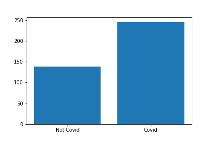
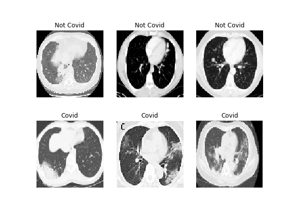
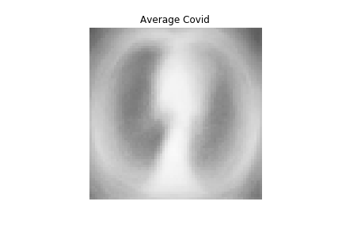
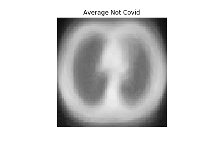
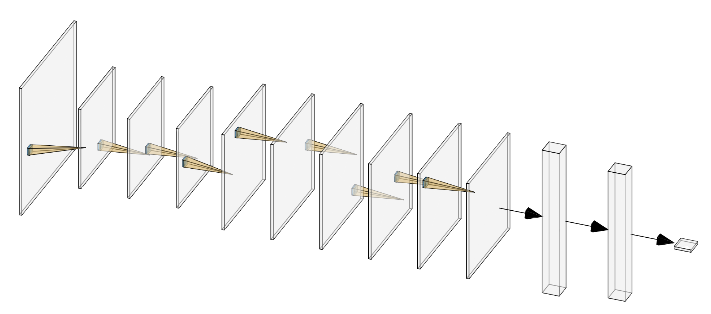

# Classifying Covid-19 from CT Scans (WIP)

**Aren Carpenter**

September/October 2020

Submission for Grand Challenge's 'CT Diagnosis of Covid-19' challenge. It is a binary classification problem for determining the presence of Covid-19 solely from CT scans of patients. 

## Introduction & Social Case

Few outbreaks in modern history have had as large of a public health and economic effect as Covid-19. While a vaccine is still in progress, physicians need cheap and effective techniques for identifying Covid-19 positive patients. 

As of Sept 12, 2020, there have been more than 28 million cases and 900,000 deaths related to Covid-19, including 200,000 in the United States alone. 

## Repository Navigation

* **[001_Image_Load_and_Clean.ipynb](001_Image_Load_and_Clean.ipynb)**: Loading images and creating train/validation/test sets with a 70/15/15 split
* **[002_Exploratory_Data_Analysis](002_Exploratory_Data_Analysis.ipynb)**: Exploratory Data Analysis to create visualizations, including average images, class imbalance chart, and std images
* **[003_Modeling.ipynb](003_Modeling.ipynb)**: Modeling locally with Keras framework

001 allows one to make directories and sort images according once data has been downloaded locally. 002 lets one generate EDA visualizations from local images once sorted. 003 allows for modeling locally utilizing the Keras framework and has functions for performance evaluation and tracking.

## Data Collection

The images are collected from COVID19-related papers from medRxiv, bioRxiv, NEJM, JAMA, Lancet, etc. CTs containing COVID-19 abnormalities are selected by reading the figure captions in the papers.

The dataset contains 138 positive images and 245 negative images from 216 patients.

The data can be found on the submission's [GitHub page](https://github.com/UCSD-AI4H/COVID-CT), and the [challenge entry site](https://covid-ct.grand-challenge.org/CT-diagnosis-of-COVID-19/) can provide some additional information.

This [paper](https://arxiv.org/pdf/2003.13865.pdf) describes the collection and prep steps taken by the authors of the challenge in preparation for its usage in the public sphere. 

## Exploratory Data Analysis

### Sample Images

Here we see some randomly sampled images from each class. The Covid positive images have a "broken glass" like texture and areas of white signifying where infection has taken hold. 

### Mean Image

The mean image for each class was created by averaging each pixel across all images in a class. On the left we have the average Covid positive image, and on the right the average Covid negative image. The positive image is much hazier because the presence of Covid-19 infections leave white areas in the affected areas of the lungs. Averaged across all positive images, all areas of the lungs are affected which is why we see haze across the entire image. 

  
  

## Modeling

I utilized the Keras framework for developing a CNN model for classifying Covid-19 from patient CT scans. I iteratively expanded the model architecture from simple, single Conv2D layers to multiple sets of Conv2D layer blocks -- where multiple convolutions are performed before a MaxPooling layer. 

My best performing model had 3x3 convolutional layers with padding separated by MaxPooling layers before flattening and two hidden fully connected layers. ReLu activation functions where used in all layers except for the final sigmoid function for the output prediction. Binary cross-entropy was used as the loss function and RMSprop was the optimization function. 

Data augmentation was utilized throughout my iterative process and always improved validation metrics, for the final model I used the following augmentation parameters from the ImageDataGenerator object: brightness_range = (0.6, 1.0), rotation_range = 15, zoom_range = 0.2, horizontal_flip=True. The model was trained for 15 epochs. 

### Model Architecture

### Modeling Evaluation

A selection of my iterative modeling process. 

Model | Validation Loss | Validation Accuracy | Test Accuracy
------| -----| -------| ------
2 Conv2D, 1 Dense | 0.8533 | 0.7952 | 0.8333
3 Conv2D, 2 Dense | 0.9695 | 0.8675 | 0.7821
3 Conv2D, 2 Dense / Padding | 0.4070 | 0.8554 | 0.7692
3 Conv2D, 2 Dense / Padding / Augmented Data | 0.3381 | 0.8554 | 0.8462
3 Conv2D, 2 Dense / Padding / Extra Augmented Data | 0.2974 | 0.8434 | 0.8590
3x2 Conv2D, 2 Dense / Padding / Extra Augmented Data | 0.3164 | 0.8554 | 0.8590
**3x3 Conv2D, 2 Dense / Padding / Extra Augmented Data** | **0.2390** | **0.9036** | **0.9231**
4x3 Conv2D, 2 Dense / Padding / Extra Augmented Data | 0.4030 | 0.7952 | 0.7949
3x3 Conv2D, 2 Dense / Padding / Extra Augmented Data / 0.25 Dropout | 0.3642 | 0.8795 | 0.9103
3x3 Conv2D, 2 Dense / Padding / Extra Augmented Data / 0.4 Dropout | 0.4694 | 0.8554 | 0.8462
3x3 Conv2D, 2 Dense / Padding / Extra Augmented Data / 0.2 Dropout | 0.3895 | 0.8554 | 0.8077
3x3 Conv2D, 2 Dense / Padding / Extra Augmented Data / 0.25 Dropout / Adam | 0.6542 | 0.6386 | 0.6538

## Insights & Recommendations

## Next Steps
